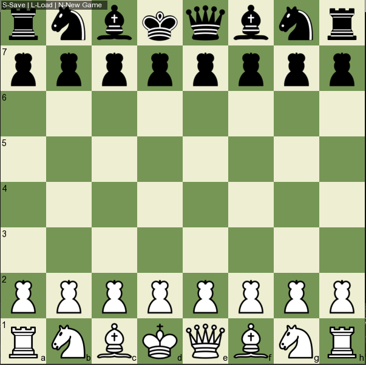

# Chess-Game-cpp
A C++ chess game built using SFML with core chess mechanics.
Features include checkmate, stalemate detection, file saving/loading, and interactive piece movement.
## 🕹️ Features
- ♟️ Play chess with a graphical board using SFML
- 🏁 Detects checkmate and stalemate
- 💾 Save and load your game progress (file handling)
- 🎨 Interactive pieces with smooth graphics
- ## 🏁 Chess Board Preview
 

  

