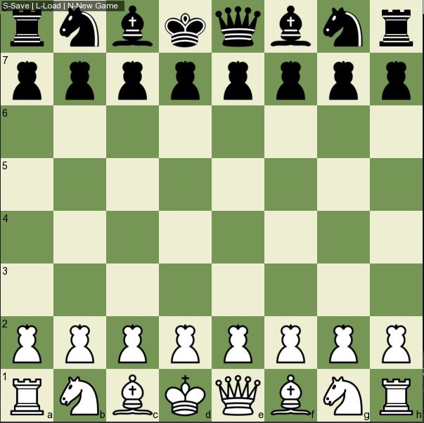

# Chess-Game-cpp
A C++ chess game built using SFML with core chess mechanics.
Features include checkmate, stalemate detection, file saving/loading, and interactive piece movement.
## 🕹️ Features
- ♟️ Play chess with a graphical board using SFML
- 🏁 Detects checkmate and stalemate
- 💾 Save and load your game progress (file handling)
- 🎨 Interactive pieces with smooth graphics
- ## 🏁 Chess Board Preview
 

  

## Prerequisites

This project requires SFML 2.x. Download it from https://www.sfml-dev.org/download.php

## How to Build (Visual Studio)

1. Clone the repository
2. Install SFML and note where you installed it (e.g. `C:\SFML\`)
3. Create a new Visual Studio C++ Console project
4. Add `chess.cpp` to the project
5. Go to **Project → Properties**:
   - Under **C/C++ → General → Additional Include Directories** add: `C:\SFML\include`
   - Under **Linker → General → Additional Library Directories** add: `C:\SFML\lib`
   - Under **Linker → Input → Additional Dependencies** add:
     - Debug: `sfml-graphics-d.lib;sfml-window-d.lib;sfml-system-d.lib`
     - Release: `sfml-graphics.lib;sfml-window.lib;sfml-system.lib`
6. Copy the SFML `.dll` files from `C:\SFML\bin\` into your project folder
7. Run from the project root so the `assets/` folder is found correctly

